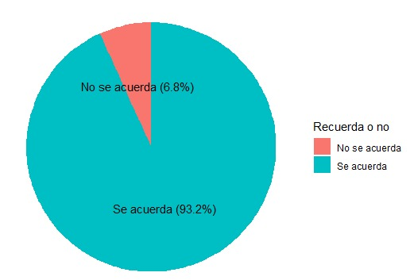
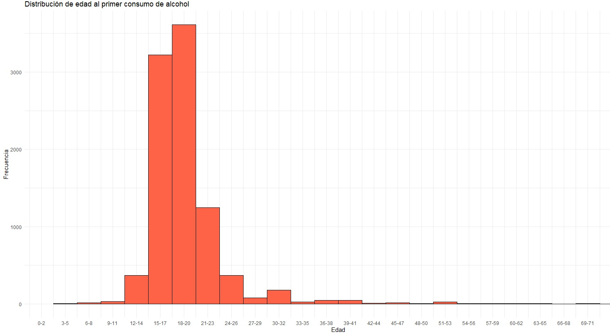
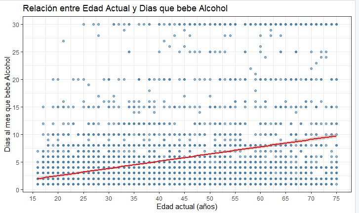
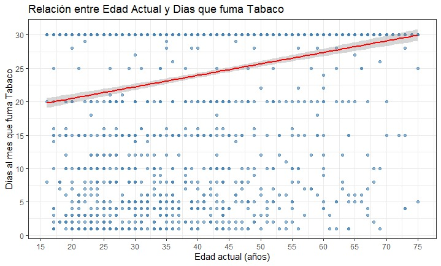

# TRABAJO PRÁCTICO
# NÚMERO 1


**Materia:** Explotación de Datos  
**Profesora:** Silvia Pérez  
**Grupo 5 - Integrantes:**
- Fernández, Marco Valentín
- Luna, Federico Sebastián Jesús
- Frascino, Juan Pablo
- Raigorodsky, Ramiro

**Universidad Nacional del Oeste**  
30 de agosto de 2025

---

## Introducción

En este trabajo estará dividido en dos partes, la PARTE A en la cual mostraremos dos gráficos, el primero es una infografía donde se analizarán 3 variables y el segundo se trata de una visualización espúrea o engañosa en el contexto de nuestro país.

Por otro lado tenemos la PARTE B en donde buscaremos una base de datos de Argentina y a través de ella realizaremos un análisis exploratorio que describa de modo univariado y bivariado la información, en donde trabajaremos con al menos una variable cualitativa y al menos 3 cuantitativas.

## 1. PARTE A

A continuación se muestran los gráficos de ejemplo.

### 1.1 Análisis de gráfico con tres variables

En la Figura 1.1 se presenta un gráfico ilustrativo que muestra la evolución de los accesos a Internet en Argentina desde enero de 2015 hasta marzo de 2025, diferenciando dos tipos principales de conexión:

- **Accesos fijos**: como los realizados desde la PC.
- **Accesos móviles**: como los realizados desde el móvil.

Al inicio del período, los dispositivos móviles cuentan con una clara ventaja; sin embargo, a lo largo de los años, los accesos fijos van acercándose progresivamente. En marzo de 2020, los accesos desde dispositivos fijos continúan creciendo, mientras que los móviles presentan una leve disminución, probablemente relacionada con la cuarentena iniciada en ese momento, que impulsó el trabajo y la educación virtual, favoreciendo así el uso de los accesos fijos.

Aquí puedes agregar todo el texto que necesites, incluso varias líneas más, y el posicionamiento de la figura se mantendrá correcto. El texto puede extenderse cuanto sea necesario sin afectar el orden de las subsecciones siguientes.


**Figura 1.1:** En el siguiente gráfico podemos observar 3 variables diferentes:
1- La cantidad de personas, medida en millones de habitantes (Eje Y)
2- Tiempo: Se mide en meses y años (Enero del 2020, Febrero del 2021, etc)
3- Tipo de acceso: Fijo (como las PC's) o móvil (como los celulares). Esta es nuestra variable de estudio.

Finalmente, desde mediados de 2023 hasta la actualidad, los accesos a través de PC predominan sobre los móviles.

### 1.2 Visualización espúrea o engañosa

En la Figura 1.2 se observa un caso espurio que se dio a conocer el 26 de junio de 2020, en plena pandemia. Este gráfico salió a la luz porque el presidente había propuesto seguir con el aislamiento hasta el 17 de julio. Se indican la cantidad de personas internadas en UTI por COVID-19; en el eje "x" se muestran las fechas, y se observa cómo, a medida que avanzaba el tiempo, aumentaba el número de internados. El problema es que tenemos 424 personas internadas en Buenos Aires + CABA y 38 en el resto del país, sumando 462, pero arriba indica 472, lo que llamó la atención de la población.


**Figura 1.2:** Total de personas internadas en UTI por COVID-19 en diferentes fechas entre el 5 de abril y el 25 de junio de 2020.

## 2. PARTE B

### 2.1 Dataset

El dataset que elegimos para nuestros análisis fue la Encuesta Nacional sobre Consumos y Prácticas de Cuidado 2022. Este contiene información actualizada al año 2022 sobre la magnitud del consumo de sustancias psicoactivas en la población urbana de 16 a 75 años, los diferentes patrones de uso y el perfil sociodemográfico de las personas consumidoras. También se indagó sobre su postura frente al ofrecimiento de drogas, su percepción del riesgo vinculado a las diferentes sustancias, y las prácticas de cuidado asociadas.

El estudio se realizó en forma conjunta entre el INDEC y la Secretaría de Políticas Integrales sobre Drogas de la Nación Argentina (Sedronar).

Nos pareció interesante puesto que nos permite indagar y estudiar cómo los vicios y adicciones afectan a los argentinos, analizando sus hábitos de consumo a lo largo de su vida y a través de las generaciones.

La base de datos puede ser descargada junto a su manual de uso en el siguiente enlace:  
`https://www.indec.gob.ar/indec/web/Institucional-Indec-BasesDeDatos-2`

### 2.2 Análisis

Introducción: durante nuestro análisis del dataset estudiamos múltiples variables y sus relaciones. Primero empezamos estudiando el manual del dataset para entender las distintas columnas de este (cómo se llamaban, qué significaban sus ponderaciones, cómo se llevó a cabo el relevamiento de datos, etc.), a partir de ahí tomamos las que nos parecían más importantes, profundizamos en ellas, en sus relaciones con otros datos, su relación con el total de los datos y finalmente realizando múltiples gráficos. Estos gráficos nos permitieron a partir de la visualización darnos cuenta que algunos análisis eran irrelevantes mientras que otros escondían información que podíamos explotar más, así fue como varios gráficos fueron eliminados, mientras que los que quedaron fueron profundizados aún más.

A continuación les presentaremos una colección de los gráficos más representativos e importantes de todos los que hicimos junto a su análisis.

### 2.3 Porcentaje de personas que recuerdan la primera vez que bebieron

**Análisis univariado de una variable cualitativa nominal**

El primer análisis que hicimos sobre la base de datos fue con respecto a una columna que representaba la edad a la que cada persona tomó alcohol por primera vez. Mientras realizamos una limpieza de los datos nos encontramos una gran cantidad de respuestas que decían que no se acordaban. Primero pensamos en simplemente eliminar esas respuestas, pero nos dimos cuenta que no era una simple respuesta más, significaba que había una cantidad significativa de personas que ni se acordaban de la primera vez que habían bebido alcohol.


**Figura 2.3:** Gráfico de torta que divide el porcentaje de gente que se acuerda y que no se acuerda de la primera vez que bebió alcohol.

El gráfico de la Figura 2.3 divide mediante un gráfico de tortas el porcentaje de gente que se acuerda y que no se acuerda de la primera vez que bebió alcohol, mostrándonos que hay casi un 7% de personas que no se acuerda, algo que nos puede dar a entender que una cantidad importante de gente le quita responsabilidad al consumo de alcohol, especialmente a temprana edad, y de ahí sale nuestro siguiente análisis.

### 2.4 Distribución de edad al primer consumo de alcohol

**Análisis univariado de una variable cuantitativa discreta**

El gráfico de la cantidad de gente que no se acuerda de la primera vez que bebió nos dio a entender que muchas veces se le suele quitar importancia al hecho de consumir alcohol, un momento que debería tener más responsabilidad ya que históricamente es algo que ocurre a temprana edad, pero ¿a qué tan temprana edad? ¿realmente sucede tan regularmente? Esas preguntas desencadenaron en la creación de nuestro segundo gráfico.


**Figura 2.4:** Histograma que muestra la distribución/densidad de las edades que tenían las personas al momento de beber alcohol por primera vez.

El gráfico de la Figura 2.4 nos muestra la distribución/densidad de las edades que tenían las personas al momento de beber alcohol por primera vez. Decidimos hacer un histograma tomando de a 3 años para que sea visualmente más representativo. La mayoría de personas tomaron por primera vez en el rango entre 15 y 20 años, pero los invitamos a ver los datos resultantes del análisis sobre la edad del primer consumo:

```
Min.      : 4.00  
1st Qu.   : 16.00  
Mediana   : 17.00  
Promedio  : 18.04  
3rd Qu.   : 19.00  
Max.      : 71.00 
```

### 2.5 Relación entre edad actual con cantidad de días al mes que bebió alcohol y que fumó tabaco

**Análisis bivariado entre cuantitativa discreta y cuantitativa discreta**

Cuando comenzamos a relevar el dataset en busca de correlacionar datos encontramos rápidamente una que podría ser interesante. Siguiendo la línea de los grupos etarios decidimos correlacionar la edad actual con la cantidad de días al mes que bebe alcohol.


**Figura 2.5:** Gráfico de nube de puntos con línea de tendencia mostrando la relación entre edad actual y cantidad de días al mes que bebe alcohol.

En la Figura 2.5 podemos observar un gráfico de nube de puntos donde el eje X es la edad actual y el eje Y es la cantidad de días al mes que bebe, a su vez hay una línea de tendencia que marca una correlación del 0.312846 entre ambos ejes. Dándonos a entender que hay una ligera tendencia a que mientras más mayor más días al mes bebe, esto puede ser por múltiples factores, tales como que la adicción empeora con los años o que la gente de generaciones más antiguas está más acostumbrada al hábito de beber. Les dejamos algunos datos sobre el análisis realizado:

```
edad_persona   dias_bebidos_mes
Min.   :16.00   Min.   : 1.000  
1st Qu.:28.00   1st Qu.: 2.000  
Median :39.00   Median : 3.000  
Mean   :41.14   Mean   : 5.301  
3rd Qu.:53.00   3rd Qu.: 5.000  
Max.   :75.00   Max.   :30.000
```

A su vez, nos pareció relevante realizar el mismo análisis pero en vez de la cantidad de días al mes que se bebía alcohol, hacerlo con la cantidad de días al mes que fumó tabaco. Lo único que tuvimos que hacer fue cambiar una columna del dataset, dándonos una correlación del 0.2589657.

  
**Figura 2.5.bis:** Gráfico de nube de puntos con línea de tendencia mostrando la relación entre edad actual y cantidad de días al mes que fumó tabaco.

En la Figura 2.5.bis vemos un gráfico igual al del alcohol pero con el tabaco, dándonos resultados similares, solamente difiriendo en el promedio de consumo:

```
Min. 1st Qu.  Median    Mean 3rd Qu.    Max. 
 1.0    20.0    30.0    24.4    30.0    30.0 
```

### 2.6 Relación entre nivel de actividad física y consumo de alcohol como hábito

**Análisis bivariado entre cualitativa nominal y cualitativa no nominal**

En este análisis lo que buscamos es marcar cómo se relaciona el tomar alcohol no como un caso eventual, sino como un hábito, y cuál es el nivel de actividad física que presentan las personas.
Para este análisis contamos con 5891 registros de respuesta.

En el gráfico de barras de la Figura 2.6 el eje X indica el nivel de actividad física, y el eje Y indica la cantidad de personas.
La segunda variable que se analiza se ve impactada en el color de cada barra. Por cada valor en el eje X tendremos la barra roja que indica la cantidad de personas que NO toma por hábito. La barra azul hace referencia a la gente que SÍ toma por hábito.

El primer aspecto tendencioso que se ve es la amplia diferencia en cantidad de personas que no consumen como hábito, respecto a las que sí lo hacen. Se puede observar que hay una diferencia mayor al doble en los 5 casos.

El segundo análisis que realizamos está enfocado a los porcentajes de consumo como hábito en los niveles más saludables.
El 27.2% del nivel 2 toma como hábito.
El 24.7% del nivel 3 toma como hábito.
El 26.0% del nivel 4 toma como hábito.
Si realizamos un promedio entre estos valores obtenemos que solo un 25.9% bebe como hábito, siendo un índice muy positivo teniendo en cuenta que hablamos de los 3 grupos más saludables.

Por otro lado evaluamos algo opuesto al punto anterior. La mayor cantidad de personas que consumen alcohol como hábito se encuentra en el grupo menos saludable. Si nos referimos a porcentaje es el 31.9% de 1519 personas que no realizan regularmente alguna actividad. Esto da una muestra clara de que el consumo habitual prevalece a menor nivel saludable que tenga un individuo.


**Figura 2.6:** Gráfico de barras respecto a cada nivel de actividad y cantidades que beben como hábito
